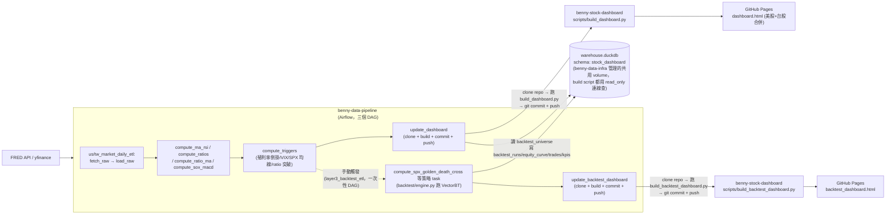

# benny-stock-dashboard

全球大總經與市場情緒轉折監測系統的**最終產出端**：靜態 dashboard html，由
GitHub Pages 託管。抓資料、算指標、判斷轉折點、跑回測都不在這個 repo 裡
發生——那些邏輯在 `benny-data-pipeline` 的 Airflow DAG 裡跑，寫進
`benny-data-infra` 管理的共用 DuckDB。這個 repo 只負責「查 DuckDB → 產靜態
html → push」，模式照抄 `Yahoo_fantasy_dashboard`。

目前有兩塊，**都已完成**：**指標/轉折點 dashboard**（`dashboard.html`，
美股+台股合併一份，2026-09-06 改版）跟**Layer 3 回測結果頁面**
（`backtest_dashboard.html`，規劃見 `layer3_backtest_proposal.md`）。指標
dashboard 的重新設計（合併 us/tw、多指標疊圖、指標定義說明、交易日曆判斷）
已在 2026-09-06 完成，詳見下方「`build_dashboard.py` 說明」。

## 這個 repo 目前放什麼

文件類都放在 `documents/` 底下（跟程式碼分開）：

- `documents/grilling_notes.md`——指標/轉折點 dashboard（Step 1-5）的設計
  討論全紀錄（拍板的決定、還在追問的坑），是這個專案的**主要參考文件**，
  這份 README 只整理「現在是什麼狀態、怎麼部署」，設計理由/決策過程一律看
  `grilling_notes.md`。
- `documents/layer3_backtest_proposal.md`——Layer 3 回測的規劃草案（哪些
  trigger 可以當進出場訊號、5 個候選策略、schema 設計、圖表需求），格式跟
  `grilling_notes.md` 一樣是「列方案 + 待決定問題」的討論記錄，是回測這塊的
  對應文件。
- `documents/market_indicators_dashboard_architecture.pdf`——原始需求文件
  （8 大指標定義、轉折點量化條件、架構草圖）。
- `documents/user_request.txt`——最初的需求描述。
- `scripts/build_dashboard.py`——查 DuckDB、產出 `output/dashboard.html`
  （美股+台股合併一份）的腳本，`benny-data-pipeline` 的 `update_dashboard`
  task 會 clone 這個 repo、跑這支腳本、commit + push，detail 見下方
  「`build_dashboard.py` 說明」。這支只管指標/轉折點頁面。
- `scripts/build_backtest_dashboard.py`——查 DuckDB 的 `backtest_*` 四張表，
  產出 `output/backtest_dashboard.html`。`benny-data-pipeline` 的
  `layer3_backtest_etl` DAG 的 `update_backtest_dashboard` task 會 clone
  這個 repo、跑這支腳本、commit + push，detail 見下方「`build_backtest_
  dashboard.py` 說明」。不用 `MARKET` 環境變數分流——一份 html 涵蓋所有
  已經跑過的策略，前端下拉選單切換。
- `output/dashboard.html`、`output/backtest_dashboard.html`——由上面兩支
  腳本產生，GitHub Pages 直接服務這兩個檔案，本機不用手動放。
- `.nojekyll`——告訴 GitHub Pages 跳過 Jekyll pipeline，直接當純靜態檔案
  服務，detail 見下方「CI/CD 流程」。

## 專案在整體架構裡的位置



## 相關 repo

| repo | 角色 |
|---|---|
| `benny-data-infra` | 共用 DuckDB 的 volume 建立 + schema 初始化（`sql/stock_dashboard/init_schema.sql`：`raw_stock`/`silver_stock`/`dim_triggers` + Layer 3 的 `backtest_universe`/`backtest_runs`/`backtest_equity_curve`/`backtest_trades`/`backtest_kpis`，共 8 張表） |
| `benny-data-pipeline` | Airflow ETL：`us_market_daily_etl`/`tw_market_daily_etl`（每天排程，抓資料、算 MA/RSI/合成指標比值/月線 MACD/轉折點 trigger，最後一個 task 觸發本 repo 的 `build_dashboard.py`）+ `layer3_backtest_etl`（一次性手動觸發，拿轉折點訊號跑 VectorBT 回測，最後一個 task 觸發本 repo 的 `build_backtest_dashboard.py`），全部寫進同一顆 DuckDB |
| `benny-stock-dashboard`（本 repo） | 查 DuckDB、產靜態 html、由 GitHub Pages 託管 |

## 目前狀態（詳細記錄見 `grilling_notes.md`/`layer3_backtest_proposal.md`）

**指標/轉折點 dashboard（`grilling_notes.md` Step 1-5 + 2026-09-06 改版）**：
架構/需求對齊、DDL、DAG 骨架、backfill script、trigger SQL（含月線 MACD）、
`scripts/build_dashboard.py` 都已完成上線，整條管線從「抓資料」到「產出
dashboard html push 到 GitHub Pages」已經打通並實際運作中。2026-09-06 完成
重新設計：美股+台股合併成一份 `dashboard.html`、指標 filter 改多選（2 個
以上自動切換成指數化比較模式）、`_STATE` trigger 背景著色、指標定義
glossary、交易日曆判斷（`pandas_market_calendars`，取代舊版「永遠顯示但不
判斷」的紅字）。

**Layer 3 回測（`layer3_backtest_proposal.md`）**：schema（`backtest_universe`
+ 四張回測結果表）、10 年歷史回補腳本、`layer3_backtest_etl` DAG（目前接了
一個策略：SPX 金叉死叉 sanity check）、VectorBT 轉換邏輯、
`scripts/build_backtest_dashboard.py` 都已完成，並經過本地端到端驗證
（合成資料跑過整條「訊號 → VectorBT → 寫 DB → 查詢 → JSON → html」的鏈路，
也已經對真實回補的 10 年資料實際跑過一次 DAG）。**目前只有一個策略**（方案
四 sanity check），`layer3_backtest_proposal.md` 列的方案三/一/二/五還沒
接上，是下一步。

## `build_dashboard.py` 說明

這支只負責指標/轉折點 dashboard（`raw_stock`/`silver_stock`/
`dim_triggers`），**不涵蓋 Layer 3 的回測結果**——回測結果讀的是另外四張
表，由獨立的 `scripts/build_backtest_dashboard.py` 負責，見下方它自己的
說明章節。

- **入口參數**：只有 `DUCKDB_PATH`（預設 `/data/warehouse.duckdb`）——
  2026-09-06 拿掉 `MARKET` 環境變數，一次查全部市場，輸出單一
  `output/dashboard.html`。
- **查詢範圍**：跟 backfill 一樣抓最近 2 年（決定 15），不是查全部歷史——
  DB 本身不設 retention，但 dashboard 查詢層設上限，避免頁面隨資料量無限
  變大。
- **真實指標 vs 合成指標資料形狀不同**：真實指標（`index_id` 1-11）原始數值
  從 `raw_stock` 撈，合成指標（101+）沒有 `raw_stock` 資料，直接把
  `silver_stock` 裡 `agg_type='RAW'` 的列當作「數值」。兩者統一組成同一份
  `INDICES` JSON 結構餵給前端，前端不用知道這個差異，每個指標額外帶
  `market`（`us`/`tw`，前端 filter 分組用）跟 `glossary`（指標說明）欄位。
- **指標 filter 改多選，2 個以上自動切換成比較模式（2026-09-06）**：選 1
  個指標維持原本的深度檢視（MA50/MA200 疊價格線、markPoint 標記事件型
  trigger、RSI/MACD 子圖）；選 2 個以上時，價格/比值改成以目前時間窗口的
  起點重新指數化成 100 疊在同一張圖上（跨量級比較，例如利率 vs 指數 vs
  股價），事件型 trigger 改成整張圖的垂直 `markLine`（不再綁定單一指標的
  y 值），RSI/MACD 子圖在比較模式下隱藏（那是單一指標的深度檢視功能）。
- **`_STATE` trigger 背景著色（2026-09-06 新增）**：`_STATE` 沒有存
  `is_active` 欄位，只有原始 `trigger_value`，`build_dashboard.py` 的
  `STATE_ACTIVE_RULES` 重新判斷每個 `_STATE` 家族的 active 門檻、收斂成
  連續區間，前端用 ECharts `markArea` 畫成半透明色塊。**門檻必須跟
  `compute_triggers.sql` 對應 CTE 的 `is_active` 條件保持一致**，兩邊沒有
  共用機制，SQL 改門檻這裡要記得手動跟著改（跟 `STRATEGY_SIGNAL_MAP` 是
  同一種已知限制）。
- **指標定義 glossary（2026-09-06 新增）**：`GLOSSARY` dict（`index_id` →
  說明文字）直接寫死在 `build_dashboard.py` 裡，不 import
  `benny-data-pipeline` 的 `constants/index_map.py`（決定 12-C 的既有慣例：
  `index_name` 已經 denormalize 進每一列，這裡比照辦理）。目前選取的指標
  說明會顯示在 filter 下方的「指標說明」面板，checkbox 上也有 `title`
  hover 提示。
- **轉折點怎麼疊到圖上**：`dim_triggers` 每一列已經帶著自己的 `index_id`
  （見 `compute_triggers.sql`），單一指標模式直接依 `index_id` 疊上對應圖表
  的 `markPoint`；只疊事件型 trigger（`ENTER`/`EXIT`/`BREAKOUT`/
  `BREAKDOWN`/`*_CROSS`/`NEW_HIGH`/`NEW_LOW`），`_STATE`（每天一筆）走上面
  的背景著色，不當標記點。三角形方向只代表「進入 vs 離開一個已定義的
  條件」，不代表多空判斷（例如 `VIX_PANIC_ENTER` 用跟其他 `_ENTER` 一樣的
  向上三角，但語意是恐慌開始，通常偏空——實際意義看 tooltip 顯示的完整
  `trigger_type`）。
- **前端互動**：指標 checklist（依 `market` 分組顯示，可複選）+ 時間範圍
  下拉（`3mo`/`6mo`/`1yr`/`2yr`，對齊決定 15），資料全部內嵌在 html 裡，
  切換純前端 filter，不重新查詢。RSI/MACD 子圖只在單一指標模式、且該指標
  有對應資料時才顯示（MACD 目前只有 SOX，`index_id=7`）。
- **交易日曆判斷（2026-09-06，取代舊版紅字）**：`pandas_market_calendars`
  查美股 `NYSE`/台股 `XTAI` 日曆，算出「以今天為準，預期最新應該有資料的
  交易日」，跟 DB 實際最新 `updated_at` 比較，兩個 market 各自獨立顯示
  狀態——只有「今天該有新資料但沒有」才標紅，休市日不會誤報（決定 9）。
- **模式**：整體結構（ECharts 5 CDN、深色主題 CSS 變數、資料內嵌不用後端）
  照抄 `Yahoo_fantasy_dashboard/scripts/build_dashboard.py`。

## `build_backtest_dashboard.py` 說明

- **入口參數**：只有 `DUCKDB_PATH`（預設 `/data/warehouse.duckdb`），**沒有
  `MARKET`**——回測結果按 `(strategy_name, ticker)` 分，不是按 market 分，
  一份 `output/backtest_dashboard.html` 涵蓋所有已經跑過的策略，用前端
  下拉選單切換，不像指標 dashboard 要美股/台股各出一份。
- **月度報酬熱力圖是這支腳本自己算的，DB 沒有存**：`backtest_equity_curve`
  只存每日累積淨值，月度報酬（月底淨值 / 上月底淨值 - 1）是查詢時在
  Python 這邊算出來的衍生數字，沒有必要為此多開一張表跟每日序列重複存兩份
  資料，算法見 `compute_monthly_returns()`。年度報酬目前**沒有**另外算
  （原本規劃要的是「月度/年度熱力圖」，先只做月度，年度是月度的簡單延伸，
  之後真的要看再加）。
- **訊號疊價格圖需要一份手動同步的對照表**：跟指標 dashboard 不同，
  `dim_triggers` 沒有直接告訴你「這個策略的訊號是哪個 trigger_type」——
  這個對應關係只存在 `benny-data-pipeline` 的 `backtest/strategies.py`
  裡，兩個 repo 沒有共用 Python 套件機制（跟決定 12-C `index_name`
  denormalize 的理由一樣），所以這支腳本自己維護一份小對照表
  `STRATEGY_SIGNAL_MAP`（`strategy_name` → 訊號的 `market`/`index_id`/
  `entry_trigger`/`exit_trigger`）。**新增策略時容易漏掉的一步**：
  `benny-data-pipeline` 那邊加了新策略，這裡的 `STRATEGY_SIGNAL_MAP`
  也要手動補一筆，不補的話那個策略的 KPI/Equity Curve/交易列表都正常
  顯示，只是「訊號疊價格圖」找不到對照、安靜地不疊出任何標記，不會報錯，
  容易被忽略。
- **訊號疊在哪張圖上**：疊在「交易標的的價格走勢」（`backtest_universe`）
  上，不是疊在「訊號來源指標」（例如 SPX 本身）上——因為使用者關心的是
  「這個訊號觸發時，我實際交易的東西發生了什麼事」，不是訊號指標自己的
  走勢（雖然目前唯一的策略訊號來源跟交易標的高度相關，SPX 訊號、SPY
  交易，兩者走勢幾乎一樣，這個區別暫時看不太出來，之後方案五 SOX MACD
  訊號、交易 2330.TW 這種訊號跟標的不同源的策略，這個設計就會顯現出來）。
- **零交易/資料不足的邊界情況**：`backtest_kpis` 的比率型欄位（Sharpe/
  Sortino/Calmar/勝率/Profit Factor）可能是 `NULL`，前端一律顯示成
  `—`，不會出現 `NaN`/`undefined` 這種難看的字樣；月度熱力圖資料不滿一個
  月時顯示提示文字而不是空白圖表。
- **模式**：整體結構（ECharts 5 CDN、深色主題 CSS 變數）跟
  `build_dashboard.py` 一致，維持整個 repo 視覺風格統一。

## CI/CD 流程

這個 repo 本身**沒有自己的 `deploy.yml`**——資料處理的邏輯完全在另外兩個
repo 裡跑，各自有獨立的自動部署管道，這裡整理一份總覽方便追蹤全貌。兩條
pipeline 都用 **self-hosted runner**，跑在**同一台**常駐開機的 Lightsail/
EC2 主機上（跟本機開發用同一份 docker-compose，只是搬到主機常駐執行）。

### Pipeline 1：`benny-data-infra/.github/workflows/deploy.yml`（DuckDB schema）

- **觸發**：push 到 `master`（或手動 `workflow_dispatch`）
- **執行**：`make start` → `docker compose -f local/duckdb.docker-compose.yaml up --abort-on-container-exit`
- **實際動作**：起一個**一次性**的 `duckdb-init` container（`python:3.11-slim`），
  掛載共用 volume `benny-infra-duckdb-data`，執行 `local/init_db.py` 對
  DuckDB 跑 schema DDL，跑完就結束——不是常駐服務，**不會碰到 Airflow 的
  webserver/scheduler**。
- **冪等，但只處理「新表」**：DDL 都是 `CREATE TABLE IF NOT EXISTS`，
  `init_db.py` 掃過 `sql/*/init_schema.sql` 每個專案資料夾全部執行一遍
  （2026-08-19 修正，本專案的 `sql/stock_dashboard/init_schema.sql` 現在
  也會被跑到，之前這條 pipeline 寫死只掛 `sql/fantasy/` 那份，已修好）。
  但這只代表「開新專案、新增一整份 `init_schema.sql`」會被自動建出來——
  **改動已經存在的表**（加欄位、改型別...）`CREATE TABLE IF NOT EXISTS`
  對已存在的表是 no-op，push 上去 CD 照跑但正式環境的表結構不會變，
  要手動連上主機進 DuckDB 下 `ALTER TABLE` 處理，detail 見
  `benny-data-infra` README「正式環境」章節。

### Pipeline 2：`benny-data-pipeline/.github/workflows/deploy.yml`（Airflow）

- **觸發**：push 到 `master`（或手動 `workflow_dispatch`）
- **執行**：`make build`（`docker compose build`，有 Docker layer cache，
  `Dockerfile`/`pyproject.toml` 沒改幾秒就跳過）→ `make start`
  （`docker compose up -d airflow-webserver airflow-scheduler`）
- **實際動作**：`dags/`、`etl/` 是 **bind mount** 進 container，不是
  `COPY` 進 image——所以大部分 DAG 程式碼改動（例如這次 Step 5 加的
  `compute_triggers.sql`、`etl/macd.py`）根本不需要重建 image，Airflow
  scheduler 會自己偵測到新檔案；只有真的動到 `Dockerfile`/`pyproject.toml`
  （例如新增 Python 套件）才會觸發真正的 image 重建。
- `docker compose up -d` 是冪等的：image 沒變就不會真的重啟 container；
  image 真的變了，`airflow-webserver`/`airflow-scheduler` 才會短暫重啟
  （幾秒鐘），不影響 Postgres（Airflow 中繼資料庫）跟 DuckDB volume——兩者
  都是外部持久化資源，這個指令碰不到。

### 兩條 pipeline 的依賴順序

`benny-data-pipeline` 的 `airflow.docker-compose.yaml` 把 DuckDB volume
宣告成 `external: true`（只用，不建立）；真正**建立/擁有**這顆 volume 的是
`benny-data-infra`（`duckdb.docker-compose.yaml` 裡 `volumes: duckdb-data:
name: benny-infra-duckdb-data`，沒有 `external: true`）。所以**首次建置
主機時，Pipeline 1 必須先成功跑過一次，volume 才會存在**，Pipeline 2 才
啟動得起來。日常開發階段兩邊各自獨立 push、各自觸發各自的 pipeline，不會
互相等待，只有第一次建主機時有這個先後順序。

### Self-hosted runner

兩條 pipeline 都用 self-hosted runner（不是 GitHub 代管的 runner），跑在
同一台主機上——每個 repo 各自到自己的 GitHub Settings → Actions → Runners
註冊一次。runner 是主機主動連出去 poll GitHub 要工作，不需要對外開任何
inbound port，也不需要每次手動 SSH 上去部署。

```
本機改 code → push GitHub master（benny-data-infra 或 benny-data-pipeline）
   → GitHub 通知主機上對應的 self-hosted runner「有新 commit」
   → runner 自動 checkout + 跑對應 repo 的 make 指令
   （全自動，兩個 repo 的 runner 各自獨立運作）
```

首次建主機（開 Lightsail/EC2、裝 Docker、註冊 runner、放 `.env`）的完整
步驟見 `benny-data-infra` README「正式環境」章節，兩個 repo 是同一套流程，
不重複寫一次。
