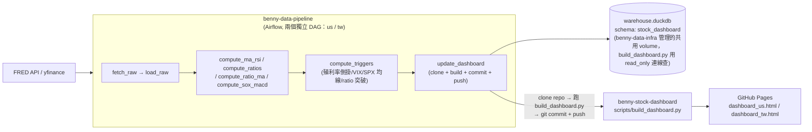

# benny-stock-dashboard

全球大總經與市場情緒轉折監測系統的**最終產出端**：靜態 dashboard html，由
GitHub Pages 託管。抓資料、算指標、判斷轉折點都不在這個 repo 裡發生——那些
邏輯在 `benny-data-pipeline` 的 Airflow DAG 裡跑，寫進 `benny-data-infra`
管理的共用 DuckDB。這個 repo 只負責「查 DuckDB → 產靜態 html → push」，模式
照抄 `Yahoo_fantasy_dashboard`。

## 這個 repo 目前放什麼

- `grilling_notes.md`——設計討論全紀錄（拍板的決定、還在追問的坑），是這個
  專案的**主要參考文件**，這份 README 只整理「現在是什麼狀態、怎麼部署」，
  設計理由/決策過程一律看 `grilling_notes.md`。
- `market_indicators_dashboard_architecture.pdf`——原始需求文件（8 大指標
  定義、轉折點量化條件、架構草圖）。
- `user_request.txt`——最初的需求描述。
- `scripts/build_dashboard.py`——查 DuckDB、產出 `output/dashboard_{market}.html`
  的腳本，`benny-data-pipeline` 的 `update_dashboard` task 會 clone 這個
  repo、帶 `MARKET=us`/`MARKET=tw` 跑這支腳本、commit + push，detail 見下方
  「`build_dashboard.py` 說明」。
- `output/dashboard_us.html`、`output/dashboard_tw.html`——由上面那支腳本
  產生，GitHub Pages 直接服務這兩個檔案，本機不用手動放。

## 專案在整體架構裡的位置



## 相關 repo

| repo | 角色 |
|---|---|
| `benny-data-infra` | 共用 DuckDB 的 volume 建立 + schema 初始化（`sql/stock_dashboard/init_schema.sql`：`raw_stock`/`silver_stock`/`dim_triggers` 三張表） |
| `benny-data-pipeline` | Airflow ETL：`us_market_daily_etl`/`tw_market_daily_etl` 兩個 DAG，抓資料、算 MA/RSI/合成指標比值/月線 MACD/轉折點 trigger，全部寫進 DuckDB，最後一個 task 觸發本 repo 的 build script |
| `benny-stock-dashboard`（本 repo） | 查 DuckDB、產靜態 html、由 GitHub Pages 託管 |

## 目前狀態（詳細記錄見 `grilling_notes.md`）

架構/需求對齊、DDL、DAG 骨架、backfill script、trigger SQL（含月線 MACD）、
`scripts/build_dashboard.py` 都已完成，並經過本地 DuckDB 合成資料端到端驗證
（SQL → Python 查詢/reshape → JSON 內嵌 → html render）。整條管線從「抓資料」
到「產出 dashboard html push 到 GitHub Pages」骨架已經打通。

## `build_dashboard.py` 說明

- **入口參數**：`MARKET` 環境變數（`us`/`tw`，必填），`DUCKDB_PATH`（預設
  `/data/warehouse.duckdb`）。輸出 `output/dashboard_{MARKET}.html`。
- **查詢範圍**：跟 backfill 一樣抓最近 2 年（決定 15），不是查全部歷史——
  DB 本身不設 retention，但 dashboard 查詢層設上限，避免頁面隨資料量無限
  變大。
- **真實指標 vs 合成指標資料形狀不同**：真實指標（`index_id` 1-11）原始數值
  從 `raw_stock` 撈，合成指標（101+）沒有 `raw_stock` 資料，直接把
  `silver_stock` 裡 `agg_type='RAW'` 的列當作「數值」。兩者統一組成同一份
  `INDICES` JSON 結構餵給前端，前端不用知道這個差異。
- **轉折點怎麼疊到圖上**：`dim_triggers` 每一列已經帶著自己的 `index_id`
  （見 `compute_triggers.sql`），直接依 `index_id` 分組疊上對應圖表的
  `markPoint`，不需要另外維護一份「trigger_type 屬於哪個指標」的對照表。
  只疊事件型 trigger（`ENTER`/`EXIT`/`BREAKOUT`/`BREAKDOWN`/`*_CROSS`/
  `NEW_HIGH`/`NEW_LOW`），`_STATE`（每天一筆）不疊——疊了畫面會被蓋滿，
  目前也還沒有背景著色的設計。三角形方向只代表「進入 vs 離開一個已定義的
  條件」，不代表多空判斷（例如 `VIX_PANIC_ENTER` 用跟其他 `_ENTER` 一樣的
  向上三角，但語意是恐慌開始，通常偏空——實際意義看 tooltip 顯示的完整
  `trigger_type`）。
- **前端互動**：指標下拉選單（真實指標排前面、合成指標排後面）+ 時間範圍
  下拉（`3mo`/`6mo`/`1yr`/`2yr`，對齊決定 15），資料全部內嵌在 html 裡，
  切換選單純前端 filter，不重新查詢。RSI 子圖只有真實指標有資料才顯示；
  MACD 子圖只有 SOX（`index_id=7`）有資料才顯示，其餘指標選取時自動隱藏。
- **紅字更新時間**：頁首顯示 `raw_stock` 裡該 market 最新一筆 `updated_at`，
  固定用紅字呈現，讓使用者自己判斷資料是否過期（決定 5）——目前沒有交易
  日曆判斷，不會自動分辨「休市」跟「API 真的掛了」，這行字誠實反映資料庫
  現況即可。
- **模式**：整體結構（ECharts 5 CDN、深色主題 CSS 變數、資料內嵌不用後端）
  照抄 `Yahoo_fantasy_dashboard/scripts/build_dashboard.py`。

## CI/CD 流程

這個 repo 本身**沒有自己的 `deploy.yml`**——資料處理的邏輯完全在另外兩個
repo 裡跑，各自有獨立的自動部署管道，這裡整理一份總覽方便追蹤全貌。兩條
pipeline 都用 **self-hosted runner**，跑在**同一台**常駐開機的 Lightsail/
EC2 主機上（跟本機開發用同一份 docker-compose，只是搬到主機常駐執行）。

### Pipeline 1：`benny-data-infra/.github/workflows/deploy.yml`（DuckDB schema）

- **觸發**：push 到 `master`（或手動 `workflow_dispatch`）
- **執行**：`make start` → `docker compose -f local/duckdb.docker-compose.yaml up --abort-on-container-exit`
- **實際動作**：起一個**一次性**的 `duckdb-init` container（`python:3.11-slim`），
  掛載共用 volume `benny-infra-duckdb-data`，執行 `local/init_db.py` 對
  DuckDB 跑 schema DDL，跑完就結束——不是常駐服務，**不會碰到 Airflow 的
  webserver/scheduler**。
- **冪等，但只處理「新表」**：DDL 都是 `CREATE TABLE IF NOT EXISTS`，
  `init_db.py` 掃過 `sql/*/init_schema.sql` 每個專案資料夾全部執行一遍
  （2026-08-19 修正，本專案的 `sql/stock_dashboard/init_schema.sql` 現在
  也會被跑到，之前這條 pipeline 寫死只掛 `sql/fantasy/` 那份，已修好）。
  但這只代表「開新專案、新增一整份 `init_schema.sql`」會被自動建出來——
  **改動已經存在的表**（加欄位、改型別...）`CREATE TABLE IF NOT EXISTS`
  對已存在的表是 no-op，push 上去 CD 照跑但正式環境的表結構不會變，
  要手動連上主機進 DuckDB 下 `ALTER TABLE` 處理，detail 見
  `benny-data-infra` README「正式環境」章節。

### Pipeline 2：`benny-data-pipeline/.github/workflows/deploy.yml`（Airflow）

- **觸發**：push 到 `master`（或手動 `workflow_dispatch`）
- **執行**：`make build`（`docker compose build`，有 Docker layer cache，
  `Dockerfile`/`pyproject.toml` 沒改幾秒就跳過）→ `make start`
  （`docker compose up -d airflow-webserver airflow-scheduler`）
- **實際動作**：`dags/`、`etl/` 是 **bind mount** 進 container，不是
  `COPY` 進 image——所以大部分 DAG 程式碼改動（例如這次 Step 5 加的
  `compute_triggers.sql`、`etl/macd.py`）根本不需要重建 image，Airflow
  scheduler 會自己偵測到新檔案；只有真的動到 `Dockerfile`/`pyproject.toml`
  （例如新增 Python 套件）才會觸發真正的 image 重建。
- `docker compose up -d` 是冪等的：image 沒變就不會真的重啟 container；
  image 真的變了，`airflow-webserver`/`airflow-scheduler` 才會短暫重啟
  （幾秒鐘），不影響 Postgres（Airflow 中繼資料庫）跟 DuckDB volume——兩者
  都是外部持久化資源，這個指令碰不到。

### 兩條 pipeline 的依賴順序

`benny-data-pipeline` 的 `airflow.docker-compose.yaml` 把 DuckDB volume
宣告成 `external: true`（只用，不建立）；真正**建立/擁有**這顆 volume 的是
`benny-data-infra`（`duckdb.docker-compose.yaml` 裡 `volumes: duckdb-data:
name: benny-infra-duckdb-data`，沒有 `external: true`）。所以**首次建置
主機時，Pipeline 1 必須先成功跑過一次，volume 才會存在**，Pipeline 2 才
啟動得起來。日常開發階段兩邊各自獨立 push、各自觸發各自的 pipeline，不會
互相等待，只有第一次建主機時有這個先後順序。

### Self-hosted runner

兩條 pipeline 都用 self-hosted runner（不是 GitHub 代管的 runner），跑在
同一台主機上——每個 repo 各自到自己的 GitHub Settings → Actions → Runners
註冊一次。runner 是主機主動連出去 poll GitHub 要工作，不需要對外開任何
inbound port，也不需要每次手動 SSH 上去部署。

```
本機改 code → push GitHub master（benny-data-infra 或 benny-data-pipeline）
   → GitHub 通知主機上對應的 self-hosted runner「有新 commit」
   → runner 自動 checkout + 跑對應 repo 的 make 指令
   （全自動，兩個 repo 的 runner 各自獨立運作）
```

首次建主機（開 Lightsail/EC2、裝 Docker、註冊 runner、放 `.env`）的完整
步驟見 `benny-data-infra` README「正式環境」章節，兩個 repo 是同一套流程，
不重複寫一次。
