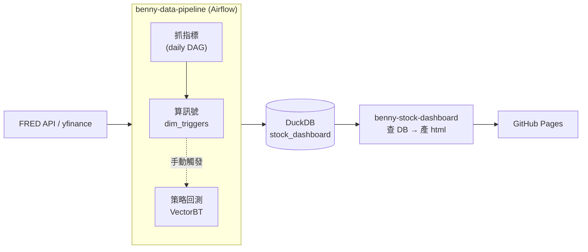

# benny-stock-dashboard

全球大總經與市場情緒轉折監測系統的**產出端**：兩份靜態 dashboard html，由
GitHub Pages 託管。抓資料、算指標、判斷訊號、跑策略回測都不在這個 repo
發生——那些邏輯在 `benny-data-pipeline` 的 Airflow DAG 裡跑，寫進
`benny-data-infra` 管理的共用 DuckDB（schema: `stock_dashboard`）。這個
repo 只做一件事：**查 DuckDB → 產靜態 html → push**。

整個系統圍繞四個概念運作：

| 概念 | 是什麼 | 存在哪 |
|---|---|---|
| **指標**（Indicator） | 8 大美股/總經數據 + 台股大盤/台積電，另外算 3 個跨指標比值 | `raw_stock`/`silver_stock` |
| **訊號**（Signal / Trigger） | 指標觸發某個量化條件的事件（金叉死叉、恐慌、倒掛...） | `dim_triggers` |
| **策略**（Strategy） | 拿訊號當進出場依據，用 VectorBT 回測績效 | `backtest_*`（4 張表） |
| **儀表板**（Dashboard） | 把上面三個查出來畫成圖，這個 repo 負責 | `output/*.html` |

## 指標（Indicator）

真實指標直接從 FRED/yfinance 抓，合成指標是跨指標比值、現算不打 API。
定義集中在 `benny-data-pipeline` 的 `constants/index_map.py`（唯一事實
來源），白話說明另外寫死一份在 `scripts/build_dashboard.py` 的
`GLOSSARY` dict（決定 12-C：不跨 repo import，`index_name` 已經
denormalize 進每一列）。

| id | 指標 | market | 來源 |
|---|---|---|---|
| 1 | 10年期美債殖利率（DGS10） | us | FRED |
| 2 | 2年期美債殖利率（DGS2） | us | FRED |
| 3 | 10Y-2Y 殖利率利差（T10Y2Y） | us | FRED |
| 4 | VIX 恐慌指數 | us | yfinance |
| 5 | S&P 500 指數 | us | yfinance |
| 6 | Nasdaq 指數 | us | yfinance |
| 7 | 費城半導體指數（SOX） | us | yfinance |
| 8 | 道瓊工業指數（DJI） | us | yfinance |
| 9 | 羅素 2000 指數（RUT） | us | yfinance |
| 10 | 台股加權指數 | tw | yfinance |
| 11 | 台積電（2330.TW） | tw | yfinance |
| 101 | SOX/SPX Ratio（合成） | us | 現算 |
| 102 | 道瓊/那指 Ratio（合成） | us | 現算 |
| 103 | 羅素2000/SPX Ratio（合成） | us | 現算 |

每個指標每天算 MA50/MA200/RSI14（`silver_stock`），SOX 額外算月線 MACD。

## 訊號（Signal / Trigger）

`dim_triggers` 是 EAV 設計，同一個訊號家族拆三種 `trigger_type`：
`_STATE`（每天一筆，目前是否成立）、`_ENTER`/`_EXIT`（狀態轉換瞬間）；
金叉死叉/創新高破底這種是「當天達成的成就」，沒有 `_STATE`。SQL 定義在
`benny-data-pipeline/dags/stock_dashboard_etl/templates/compute_triggers.sql`
（月線 MACD 例外，在 `etl/macd.py` 用 pandas 算），白話說明在
`build_dashboard.py` 的 `TRIGGER_GLOSSARY`。

| 訊號 | 指標 | 條件 |
|---|---|---|
| 殖利率倒掛/解倒掛 | T10Y2Y | < 0 |
| VIX 恐慌/自滿 | VIX | ≥30 恐慌、≥35 極度恐慌、<12 自滿 |
| SPX 站上/跌破 50SMA、200SMA | SPX | 價格 vs 均線 |
| SPX 金叉/死叉 | SPX | MA50 vs MA200 |
| RUT/SPX 站上/跌破 200SMA | Ratio 101 | 比值 vs 均線 |
| DJI/IXIC 20 日動能 | Ratio 102 | 20 日漲幅 >3% |
| SOX/SPX 創 252 日新高/新低 | Ratio 101 | 52 週新高/破底 |
| SOX 月線 MACD 黃金/死亡交叉 | SOX | EMA12/26 交叉 |

## 策略（Strategy）

Layer 3：拿 `dim_triggers` 的訊號當買賣訊號，`backtest/engine.py` 跑
VectorBT，結果寫進 `backtest_runs`/`backtest_equity_curve`/
`backtest_trades`/`backtest_kpis`（key 是 `(strategy_name, ticker)`）。
策略定義在 `benny-data-pipeline` 的 `backtest/strategies.py`，一次性
`layer3_backtest_etl` DAG 觸發（不是每天排程）。

| 策略 | 交易標的 | 進場 | 出場 | 狀態 |
|---|---|---|---|---|
| `spx_golden_death_cross` | SPY | SPX 金叉 | SPX 死叉 | 已完成 |
| `sox_spx_ratio_rotation` | 2330.TW、006208.TW（各自獨立結果） | SOX/SPX 創新高 | SOX/SPX 破新低 | 已完成 |
| `extreme_fear_dip_buy_60d`/`_120d` | SPY | VIX 極度恐慌 + SOX RSI14<30 | 固定持有 60/120 個交易日 | 已完成 |
| `sox_macd_rotation` | SOXX | SOX 月線 MACD 黃金交叉 | SOX 月線 MACD 死亡交叉 | 已完成 |
| 倒掛解開避險 | SPY | 解倒掛 + 倒掛超過100日 + SPX 跌破MA50 | **未定義** | 待補（缺出場規則） |

基準一律是「回測起點就買、抱到最後」的 buy & hold，跟策略同一天起算，
公平比較「進出場」vs「全押抱著」。詳細規劃/討論見
`documents/layer3_backtest_proposal.md`。

## 儀表板（Dashboard）

| 頁面 | 查什麼 | 產生腳本 |
|---|---|---|
| `output/dashboard.html` | 指標走勢 + 訊號標記（美股+台股合併一份） | `scripts/build_dashboard.py` |
| `output/backtest_dashboard.html` | 策略回測結果 | `scripts/build_backtest_dashboard.py` |

兩份都是 ECharts 5（CDN）+ 深色主題，資料整包內嵌在 html 裡，不需要後端，
兩支腳本模式一致，各自的細節：

**`dashboard.html`**：
- 指標 filter 是多選 checklist（依 market 分組）——選 1 個是深度檢視
  （MA/RSI/MACD + 事件標記），選 2 個以上自動切換成「指數化比較模式」
  （各自以窗口起點重新指數化成 100，疊在同一張圖，方便跨量級比較）。
- `_STATE` 訊號背景著色（`markArea`）、事件型訊號疊三角形標記
  （`markPoint`，比較模式改垂直虛線）。
- 指標/訊號都有白話說明面板（`GLOSSARY`/`TRIGGER_GLOSSARY`）。
- 頁首用 `pandas_market_calendars`（NYSE/XTAI）判斷「今天該不該有新
  資料」，只有真的缺資料才標紅，休市日不誤報。
- 走勢/RSI/MACD 圖都有 `dataZoom`（拖拉/滾輪縮放任意區間）。
- 響應式版面（`@media max-width:640px`）。

**`backtest_dashboard.html`**：
- 下拉選單切換策略（`(strategy_name, ticker)`，同一策略配多個標的會分開
  顯示）。
- KPI 彙總卡（總報酬/CAGR/Sharpe/Sortino/最大回撤/勝率/Alpha/Beta...）、
  Equity Curve（策略 vs 基準）、Underwater Chart、月度報酬熱力圖、逐筆
  交易列表、訊號疊在交易標的價格圖上。
- 訊號疊圖靠 `STRATEGY_SIGNAL_MAP`（策略 → trigger_type 的手動對照表，
  跟 `benny-data-pipeline` 的 `backtest/strategies.py` 分開維護，新增
  策略時兩邊都要記得改）。
- Equity Curve/Underwater/價格圖都有 `dataZoom`，也有響應式版面。

## 架構

| repo | 角色 |
|---|---|
| `benny-data-infra` | DuckDB volume + schema 初始化 |
| `benny-data-pipeline` | Airflow：抓指標、算訊號、（手動觸發）跑策略回測 |
| `benny-stock-dashboard`（本 repo） | 查 DuckDB、產靜態 html、GitHub Pages 託管 |

## 這個 repo 放什麼

- `scripts/build_dashboard.py`、`scripts/build_backtest_dashboard.py`——
  上面兩份 dashboard 的產生腳本，各自的 DAG task 會 clone 本 repo、跑
  對應腳本、commit + push。
- `output/*.html`——兩支腳本的產出，GitHub Pages 直接服務，本機不用
  手動放。
- `documents/grilling_notes.md`——指標/訊號 dashboard 的完整設計討論
  紀錄（拍板決定、追問過程），這份 README 只整理現況，設計理由一律看
  這份。
- `documents/layer3_backtest_proposal.md`——策略回測的規劃/討論紀錄。
- `documents/market_indicators_dashboard_architecture.pdf`——最原始需求
  文件。
- `.nojekyll`——GitHub Pages 跳過 Jekyll pipeline，純靜態檔案服務。

## CI/CD

這個 repo 沒有自己的 `deploy.yml`——資料處理邏輯在
`benny-data-infra`/`benny-data-pipeline` 兩個 repo 裡，各自 push 到
`master` 後由 self-hosted runner 自動部署（跑在同一台常駐主機上）。
`benny-data-pipeline` 的 DAG task 產完 html 直接 `git push` 回這個 repo，
GitHub Pages 抓到新 commit 就自動更新，本 repo 不需要另外的部署步驟。
完整 CI/CD 細節（pipeline 觸發條件、runner 註冊、首次建主機步驟）見
`benny-data-infra` README「正式環境」章節，兩個 repo 是同一套流程。
